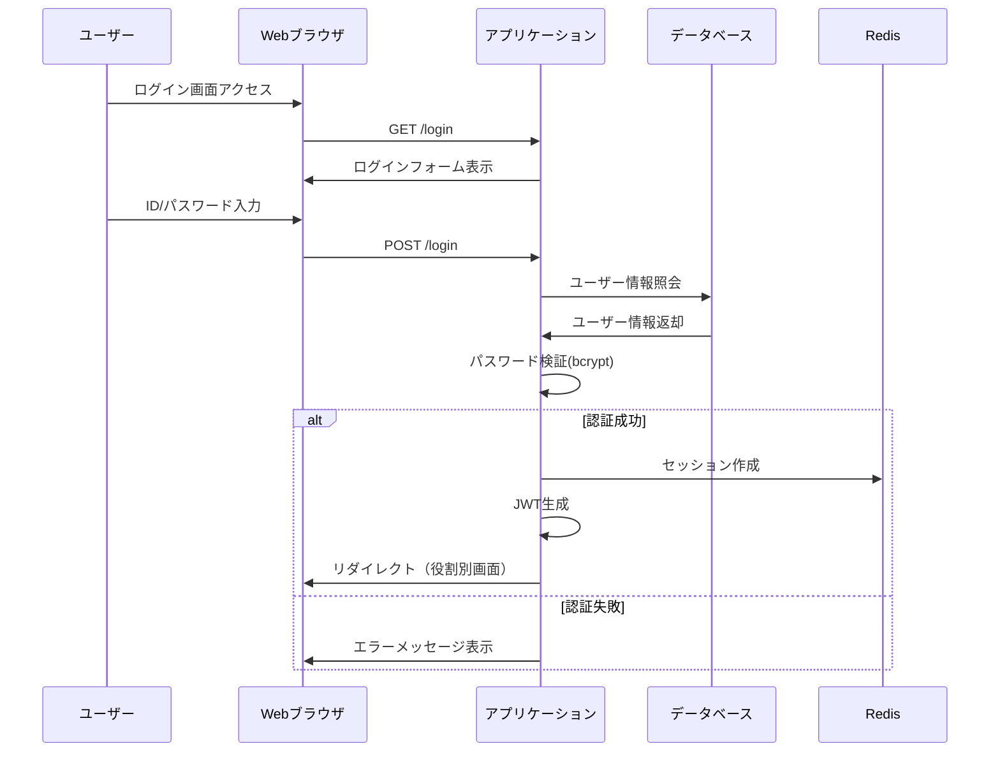
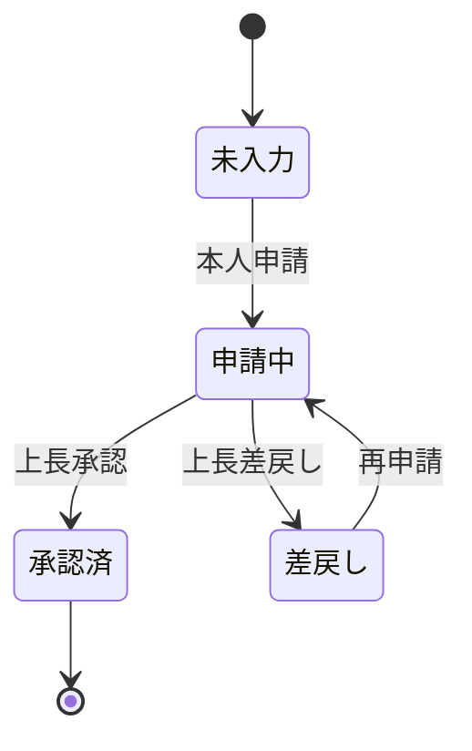
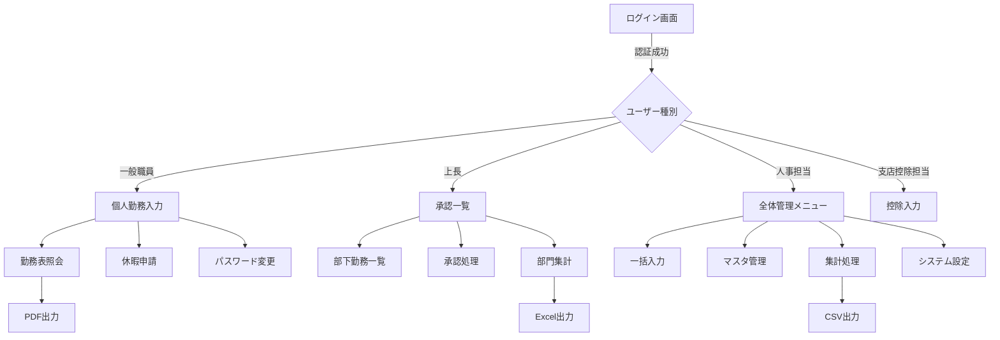
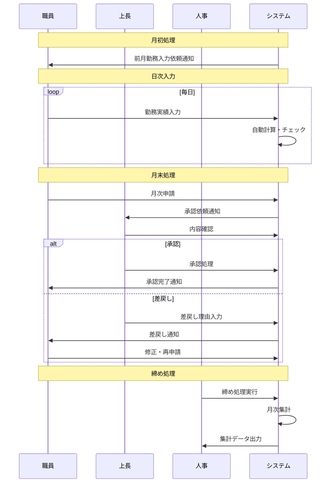
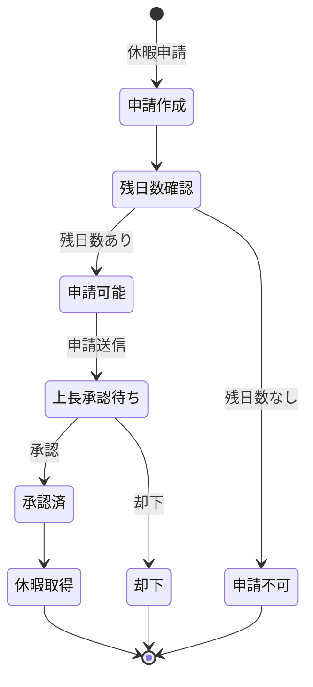

# 機能仕様書 - 勤務表管理システム

## 1. 機能一覧

### 1.1 主要機能カテゴリ

| カテゴリ | 機能グループ | 説明 |
|---------|------------|------|
| 認証・権限管理 | ログイン、ログアウト、パスワード変更 | ユーザー認証と権限制御 |
| 勤務管理 | 勤務入力、勤務表表示、タイムカード連携 | 日次勤務時間の記録と管理 |
| 承認管理 | 承認一覧、承認処理、差戻し | 上長による勤務実績承認 |
| 休暇管理 | 休暇申請、残日数管理、休暇履歴 | 各種休暇の申請と管理 |
| 集計・レポート | 月次集計、年次集計、各種帳票 | 勤務データの集計と出力 |
| マスタ管理 | 職員管理、組織管理、カレンダー管理 | 基本情報の管理 |
| システム管理 | 権限設定、システム設定、ログ管理 | システム全体の管理 |

### 1.2 ユーザー種別と利用可能機能

| ユーザー種別 | 権限フラグ | 利用可能機能 |
|------------|-----------|------------|
| 一般職員 | is_input=1 | 個人勤務入力、勤務表照会、パスワード変更 |
| 上長 | is_superior=1 | 部下承認、部門勤務状況照会 |
| 人事担当者 | is_charge=1 | 全社員勤務入力、マスタ管理、集計処理 |
| 支店控除担当者 | is_deduction=1 | 支店控除データ入力 |
| システム管理者 | is_operator=1 | システム設定、ユーザー管理 |

## 2. 機能詳細仕様

### 2.1 認証機能 (F001)

#### 2.1.1 ログイン機能

**機能概要**
- ユーザーID（個人コード）とパスワードによる認証
- 多要素認証対応（移行後新機能）
- 自動ログアウト機能（30分無操作）

**処理フロー**


**入力チェック**
| 項目 | チェック内容 | エラーメッセージ |
|------|------------|---------------|
| ユーザーID | 必須、5桁数字 | "ユーザーIDを入力してください" / "ユーザーIDは5桁の数字で入力してください" |
| パスワード | 必須、8文字以上 | "パスワードを入力してください" / "パスワードが正しくありません" |
| ログイン試行 | 5回失敗で30分ロック | "アカウントがロックされています。30分後に再試行してください" |

**データベース更新**
- stafftbl.last_login_date: 最終ログイン日時を更新
- login_log: ログイン履歴を記録（IP、日時、成功/失敗）

#### 2.1.2 パスワード変更機能

**機能概要**
- 現在のパスワードと新しいパスワードによる変更
- パスワード強度チェック
- 変更履歴管理（同一パスワードの再利用防止）

**入力チェック**
| 項目 | チェック内容 | エラーメッセージ |
|------|------------|---------------|
| 現在のパスワード | 必須、現在のパスワードと一致 | "現在のパスワードが正しくありません" |
| 新しいパスワード | 必須、8文字以上、英数字混在、記号含む | "パスワードは8文字以上で、英字・数字・記号を含めてください" |
| パスワード確認 | 新しいパスワードと一致 | "パスワードが一致しません" |
| 履歴チェック | 過去3回と異なる | "過去3回以内に使用したパスワードは使用できません" |

### 2.2 勤務入力機能 (F002)

#### 2.2.1 個人勤務入力

**機能概要**
- 月単位での勤務実績入力
- リアルタイム残業時間計算
- 労働基準法準拠チェック
- タイムカードデータ自動反映
- 3つの画面モードによる権限制御

**画面モード仕様**
| モード | 条件 | 編集可能項目 | 用途 |
|--------|------|-------------|------|
| 入力モード | 本人アクセス（デフォルト） | 全項目（承認欄除く） | 日常の勤務入力 |
| 上長チェックモード | URLパラメータ`s`+上長権限 | 承認欄、エラーフラグ、タイムカード時刻のみ | 部下の勤務承認 |
| 参照モード | 他者データ参照 or 人事権限 | なし（全て閲覧のみ） | 確認・照会 |

**モード判定ロジック**
```python
def determine_screen_mode(query_params, session):
    # デフォルト：入力モード
    screen_mode = 0
    
    # 他者のデータを参照
    if query_params.get('p') and session['username'] != query_params['p']:
        screen_mode = 1  # 参照モード
    
    # 人事担当者
    if query_params.get('c') and session.get('is_charge') == '1':
        screen_mode = 1  # 参照モード
    
    # 上長チェック（最優先）
    if query_params.get('s') and session.get('is_superior') == '1':
        screen_mode = 2  # 上長チェックモード
    
    return screen_mode
```

**編集制御仕様**
- 給与処理済み月（`ymb <= processed_ymb`）：全モードで編集不可
- 1ヶ月以上先の月：全モードで編集不可
- 承認フラグ：上長チェックモードのみ編集可
- エラーフラグ：システム自動設定（上長は確認のみ）

**画面レイアウト**
```
[年月選択] [←前月] 2024年1月 [翌月→]
[タイムカード反映] [一時保存] [承認申請]

日付 | 曜日 | 出社 | 退社 | 休憩 | 勤務時間 | 残業 | 深夜 | 休日出勤 | 備考
1日  | 月   | 08:30| 19:00| 01:00| 09:30   | 1:20 | 0:00 | -      | 
2日  | 火   | 08:30| 22:30| 01:00| 13:00   | 4:50 | 0:30 | -      | 深夜作業
...

月間集計: 勤務日数 20日 | 総労働時間 180:00 | 残業 25:30 | 深夜 2:30
36協定チェック: [OK] 月間残業 25:30/45:00 | 年間残業 120:00/360:00
```

**詳細入力チェック仕様**

##### 時刻入力フォーマット検証
| 項目 | チェック内容 | エラーメッセージ |
|------|------------|---------------|
| 時刻形式 | HH:MM, HHMM, または4桁数字 | "時刻を正しく入力してください (例: 08:30 または 0830)" |
| 時刻範囲 | 00:00-47:59（翌日対応） | "時刻は00:00から47:59の範囲で入力してください" |
| 空白許可 | 各時刻フィールドは空白可 | - |
| 自動整形 | 830→08:30, 1730→17:30 | - |

##### 勤務区分の組み合わせチェック
| エラーコード | チェック内容 | エラーメッセージ |
|------------|------------|---------------|
| 01 | 午前/午後の休暇区分が公休日・法定休日で不一致 | "午前と午後の休暇等区分の値が違います（公休日、法定休日を除く）" |
| 02 | 公休日に出勤選択（非フレックス） | "休暇等区分が公休日の時、出勤区分は勤務を選択できません" |
| 50 | 法定休日に出勤選択 | "休暇等区分が法定休日の時、出勤区分は勤務を選択できません" |
| 03 | 有給・特休・保存休・欠勤時に振替/休日出勤選択 | "休暇等区分が有給・特休・保存休・欠勤の時、出勤区分に振替又は休日出勤を選択できません" |
| 04 | 午前/午後で振替出勤と休日出勤の混在 | "午前と午後で、振替出勤と休日出勤は選択できません" |
| 24 | 振替出勤時の休暇区分違反 | "振替出勤の時、休暇等区分は公休日、振替休日、法定休日のいずれかを選択してください" |
| 54 | フレックス勤務者の公休日休日出勤 | "フレックス勤務者は公休日に休日出勤を入力できません" |

##### フレックスタイム勤務特有のチェック
| エラーコード | チェック内容 | エラーメッセージ |
|------------|------------|---------------|
| 39 | 勤務開始/終了の片方のみ入力 | "勤務開始時刻と終了時刻は両方入力してください" |
| 42 | 勤務開始/終了のペア不整合 | "勤務開始時刻・終了時刻を入力してください" |
| 43 | 休憩開始/終了のペア不整合 | "休憩開始時刻・終了時刻を入力してください" |
| 44 | 中抜け開始/終了のペア不整合 | "中抜け開始時刻・終了時刻を入力してください" |
| 45 | 勤務時間なしで休憩/中抜け入力 | "勤務開始・終了時刻が入力されていないので、休憩・中抜け時刻は入力できません" |
| 47 | 時刻の論理順序違反 | "勤務時間、休憩、中抜けの開始終了順序が正しくありません" |
| 48 | 非勤務日の勤務時間入力 | "勤務、振替出勤、休日出勤、時間有給以外の日は勤務時間を入力できません" |
| 52 | 時間代休の勤務時間外入力 | "時間代休は勤務時間内かつ休憩・中抜け時間外で入力してください" |
| 53 | フレックス勤務時間と時間外の重複 | "フレックス勤務者の勤務時間が時間外時間と重複しています" |

##### 時間外勤務チェック
| エラーコード | チェック内容 | エラーメッセージ |
|------------|------------|---------------|
| 07 | 時間外開始/終了のペア不整合 | "時間外開始時刻・終了時刻を入力してください" |
| 08 | 時間外入力時の出勤区分未選択 | "時間外を入力する時は、出勤区分に勤務、振替出勤、休日出勤、召集のいずれかを選択してください" |
| 09 | 時間外なしで休憩入力 | "時間外がないので、時間外休憩時刻は入力できません" |
| 10 | 時間外休憩のペア不整合 | "時間外休憩開始時刻・終了時刻を入力してください" |
| 11 | 時間外休憩の範囲違反 | "時間外休憩は時間外開始終了時刻内で入力してください" |
| 12 | 6時間超時間外の休憩不足 | "時間外が6時間を超える場合は、時間外休憩を45分以上入力してください" |
| 13 | 8時間超時間外の休憩不足 | "時間外が8時間を超える場合は、時間外休憩を60分以上入力してください" |

##### 時間代休チェック
| エラーコード | チェック内容 | エラーメッセージ |
|------------|------------|---------------|
| 14 | 時間代休のペア・順序不整合 | "時間代休申請開始時刻・終了時刻を正しい順序で入力してください" |
| 15 | 月間時間外超過 | "時間代休申請が当月時間外時間を超えています" |
| 26 | 時間代休の単位違反 | "時間代休申請時間数は10分単位で入力してください" |

##### 時間有給チェック
| エラーコード | チェック内容 | エラーメッセージ |
|------------|------------|---------------|
| 22 | 時間有給のペア・順序不整合 | "時間有給申請開始時刻・終了時刻を正しい順序で入力してください" |
| 23 | 時間有給時の出勤区分未選択 | "時間有給を入力する時は、出勤区分の午前と午後に勤務を選択してください" |
| 25 | 時間有給の単位違反 | "時間有給申請時間数は60分単位で入力してください" |

##### 深夜割増チェック
| エラーコード | チェック内容 | エラーメッセージ |
|------------|------------|---------------|
| 16 | 深夜割増のペア不整合 | "深夜割増開始時刻・終了時刻を入力してください" |
| 28 | 深夜時間帯外入力 | "深夜割増時間は22時から翌5時の間で入力してください" |
| 37 | 深夜割増と時間外の不整合 | "深夜割増時間は時間外時間内で入力してください" |

##### 休暇残日数チェック
| エラーコード | チェック内容 | エラーメッセージ |
|------------|------------|---------------|
| 17 | 有給休暇残不足 | "有給が残っていません" |
| 18 | 代休残不足（-2日まで許可） | "代休が残っていません" |
| 19 | 代休優先使用違反 | "代休を優先して使用してください" |
| 51 | コアタイム時間有給の制限 | "コアタイムに時間有給を取る場合、午前と午後の両方を有給にしてください" |

##### シフト勤務者チェック
| エラーコード | チェック内容 | エラーメッセージ |
|------------|------------|---------------|
| 29 | シフト勤務時の区分未選択 | "シフト番の時、休暇等区分又は出勤区分を選択してください" |
| 30 | 日勤甲番の勤務パターン違反 | "日勤甲番の時、出勤区分は午前午後とも勤務を選択してください" |
| 31 | 制作会乙番の勤務パターン違反 | "制作会乙番の時、出勤区分は午前：勤務、午後：振替出勤を選択してください" |
| 32 | シフト勤務者の時間代休禁止 | "シフト勤務者は時間代休を使用できません" |
| 33 | シフト勤務者の時間有給禁止 | "シフト勤務者は時間有給を使用できません" |
| 34 | シフト勤務者の宿直禁止 | "シフト勤務者に宿直はありません" |
| 35 | シフト勤務者の日直禁止 | "シフト勤務者に日直はありません" |

##### 宿直・日直チェック
| エラーコード | チェック内容 | エラーメッセージ |
|------------|------------|---------------|
| 20 | 日直の曜日制限 | "日直は、公休日、法定休日のみ選択できます" |
| 21 | 日直責任者の振替出勤禁止 | "日直責任者は、振替出勤の選択はできません" |

##### 36協定コンプライアンスチェック
| チェック項目 | 限度値 | エラーメッセージ |
|------------|--------|---------------|
| 日次時間外（警告） | 14時間 | "当日時間外労働が36協定の限度時間(14時間)を超えています" |
| 月間時間外 | 29時間 | "月間時間外労働時間（休日除く）が36協定限度(29時間)を超過" |
| 月間休日労働 | 15時間20分 | "月間休日労働時間が36協定限度(15時間20分)を超過" |
| 月間時間外（改革法） | 60時間 | "月間時間外労働時間が改革法限度(60時間)を超過" |
| 年間時間外 | 176時間 | "年間時間外労働時間（休日除く）が36協定限度(176時間)を超過" |
| 年間休日労働 | 184時間 | "年間休日労働時間が36協定限度(184時間)を超過" |
| 年間時間外（改革法） | 398時間 | "年間時間外労働時間が改革法限度(398時間)を超過" |
| 年間休日出勤回数 | 42回 | "年間休日労働日数が36協定限度(42回)を超過" |

##### 法定休日チェック（フレックス勤務者）
| チェック内容 | エラーメッセージ |
|------------|---------------|
| 週1日の法定休日確保 | "1週間に1日以上の法定休日が必要です" |
| 週2日以上の法定休日 | "1週間に2日以上の法定休日は設定できません" |

##### 特殊な時間計算ルール
1. **昼休み自動控除**
   - 12:00-13:00を跨ぐ勤務時間から60分自動控除
   - 時間外、時間代休、時間有給にも適用

2. **深夜時間帯計算**
   - 22:00-翌05:00の時間を自動算出
   - 日跨ぎ対応（24時間以内）

3. **勤務実績チェック（properTimeCheck）**
   - 通常勤務: 08:30-17:10基準
   - 早出許容: 30-40分前
   - 残業許容: 30-50分後
   - 宿直・前日シフトは特別扱い

**残業計算ロジック**

```python
def calculate_overtime(work_start, work_end, break_time, base_hours=8):
    """
    残業時間計算
    
    Parameters:
    - work_start: 出社時刻
    - work_end: 退社時刻
    - break_time: 休憩時間（分）
    - base_hours: 所定労働時間
    
    Returns:
    - overtime_minutes: 残業時間（分）
    - late_night_minutes: 深夜残業時間（分）
    """
    
    # 総労働時間計算
    total_minutes = (work_end - work_start).total_seconds() / 60
    actual_work_minutes = total_minutes - break_time
    
    # 所定労働時間を超えた分が残業
    base_minutes = base_hours * 60
    overtime_minutes = max(0, actual_work_minutes - base_minutes)
    
    # 深夜時間帯（22:00-05:00）の計算
    late_night_minutes = calculate_late_night_work(work_start, work_end)
    
    # 10分単位で切り捨て
    overtime_minutes = (overtime_minutes // 10) * 10
    late_night_minutes = (late_night_minutes // 10) * 10
    
    return overtime_minutes, late_night_minutes
```

**データベース更新**
- worktbl: 日次勤務データの挿入/更新
- dutyrostertbl: 月次集計データの更新

#### 2.2.2 フレックスタイム勤務入力

**特別仕様**
- コアタイム: 10:00-15:00（必須勤務時間帯）
- 月間清算期間での労働時間管理
- 週1日の法定休日確保チェック

**追加チェック**
| 項目 | チェック内容 | エラーメッセージ |
|------|------------|---------------|
| コアタイム | 10:00-15:00は勤務必須 | "コアタイム（10:00-15:00）は勤務が必要です" |
| 法定休日 | 週1日以上の休日 | "週に1日以上の法定休日が必要です" |
| 月間清算 | 月間所定労働時間±40時間 | "清算期間の上限を超えています" |

### 2.3 承認機能 (F003)

#### 2.3.1 承認一覧表示

**機能概要**
- 部下の勤務実績一覧表示
- 承認状態の可視化
- 一括承認機能
- エラーフィルタリング

**承認状態**
| 状態 | 表示 | 説明 |
|------|------|------|
| 未申請 | - | 本人が未入力 |
| 申請中 | △ | 承認待ち |
| 承認済 | ○ | 上長承認済み |
| 差戻し | × | 修正要求 |
| エラー | ⚠️ | 労基法違反等 |

**承認フロー**


#### 2.3.2 承認処理

**処理内容**
1. 入力内容の妥当性チェック
2. 労働基準法準拠チェック
3. 承認履歴の記録
4. 承認通知の送信

**データベース更新**
- worktbl.is_approval: '1'（承認済み）に更新
- approval_log: 承認履歴を記録
- notification: 本人への通知作成

### 2.4 休暇管理機能 (F004)

#### 2.4.1 休暇種別

| 休暇種別 | コード | 付与条件 | 有効期限 |
|---------|-------|---------|---------|
| 有給休暇 | 1 | 入社6ヶ月後10日、以後年次増加 | 2年 |
| 代休 | 2 | 休日出勤時 | 2ヶ月 |
| 特別休暇 | 3 | 会社規定による | 当年度内 |
| 保存休暇 | 4 | 失効有給の積立 | 無期限 |
| 時間休暇 | 5 | 有給を時間単位で取得 | 有給に準ずる |

#### 2.4.2 休暇残日数管理

**計算ロジック**
```python
def calculate_leave_balance(employee_id, leave_type, as_of_date):
    """
    休暇残日数計算
    
    Returns:
    - total_granted: 付与日数
    - total_used: 使用日数
    - balance: 残日数
    - expiring_soon: 30日以内に失効する日数
    """
    
    # 付与履歴取得
    grants = get_leave_grants(employee_id, leave_type)
    
    # 使用履歴取得
    usage = get_leave_usage(employee_id, leave_type, as_of_date)
    
    # 有効期限チェック
    valid_grants = [g for g in grants if g.expiry_date >= as_of_date]
    
    # 残数計算（先入先出）
    balance = sum(g.days for g in valid_grants) - usage
    
    # 失効予定
    expiring_soon = sum(
        g.days for g in valid_grants 
        if g.expiry_date <= as_of_date + timedelta(days=30)
    )
    
    return {
        'balance': balance,
        'expiring_soon': expiring_soon
    }
```

### 2.5 集計・レポート機能 (F005)

#### 2.5.1 月次勤務表

**出力項目**
- 基本情報: 氏名、所属、年月
- 日次明細: 日付、曜日、勤務時間、残業、休暇等
- 月次集計: 出勤日数、総労働時間、各種手当対象時間
- 承認欄: 本人、上長、人事

**出力形式**
- PDF: 印刷用フォーマット
- Excel: 編集可能形式
- CSV: システム連携用

#### 2.5.2 36協定管理表

**監視項目**
| 項目 | 基準値 | アラート閾値 | 上限値 |
|------|--------|-------------|--------|
| 日次残業 | - | 10時間 | 14時間 |
| 月次残業 | - | 40時間 | 45時間 |
| 年次残業 | - | 320時間 | 360時間 |
| 2-6ヶ月平均 | - | 70時間 | 80時間 |
| 休日出勤 | - | 月3回 | 月4回 |

### 2.6 マスタ管理機能 (F006)

#### 2.6.1 職員マスタ

**管理項目**
```python
class Staff:
    personal_code: str      # 個人コード（5桁）
    name: str              # 氏名
    organization_code: str  # 組織コード
    grade_code: str        # 等級コード
    work_shift: int        # 勤務体系
    permissions: dict      # 権限設定
    work_hours: dict       # 所定勤務時間
    hire_date: date        # 入社日
    leave_grant_date: str  # 有給付与日（MM-DD）
```

#### 2.6.2 組織マスタ

**階層構造**
```
本社 (000000)
├─ 営業本部 (100000)
│  ├─ 東日本営業部 (110000)
│  │  ├─ 東京支店 (111000)
│  │  └─ 仙台支店 (112000)
│  └─ 西日本営業部 (120000)
└─ 管理本部 (200000)
   ├─ 人事部 (210000)
   └─ 経理部 (220000)
```

#### 2.6.3 カレンダーマスタ

**管理内容**
- 国民の祝日
- 会社休日
- 特別営業日
- 年末年始休暇

### 2.7 データ入出力機能 (F007)

#### 2.7.1 CSVインポート

**フォーマット仕様**
```csv
個人コード,年月日,出社時刻,退社時刻,休憩時間,残業申請,備考
10001,2024/01/04,08:30,19:00,01:00,01:20,月次処理対応
10001,2024/01/05,08:30,17:30,01:00,00:00,
```

**インポート処理**
1. フォーマットチェック
2. データ妥当性検証
3. 重複チェック
4. 一括登録（トランザクション）
5. エラーログ出力

#### 2.7.2 Excelエクスポート

**テンプレート構造**
- Sheet1: 月次勤務表
- Sheet2: 集計サマリ
- Sheet3: 36協定チェック
- Sheet4: エラー/警告一覧

## 3. 画面遷移図



## 4. 業務フロー図

### 4.1 月次勤務管理フロー



### 4.2 休暇申請フロー



## 5. ユーザー権限マトリックス

### 5.1 基本権限（stafftblベース）

| 機能 | 一般職員 | 上長 | 人事担当 | 支店控除担当 | システム管理者 |
|------|---------|------|----------|-------------|--------------|
| 個人勤務入力 | ○ | ○ | × | × | × |
| 個人勤務照会 | ○ | ○ | ○ | × | ○ |
| 他者勤務照会 | × | △(部下のみ) | ○ | × | ○ |
| 勤務承認 | × | ○ | × | × | × |
| 一括勤務入力 | × | × | ○ | × | × |
| 休暇申請 | ○ | ○ | × | × | × |
| 休暇承認 | × | ○ | × | × | × |
| 集計処理 | × | △(部門) | ○ | × | ○ |
| マスタ参照 | △(限定) | △(限定) | ○ | △(限定) | ○ |
| マスタ更新 | × | × | ○ | × | ○ |
| 控除入力 | × | × | × | ○ | × |
| システム設定 | × | × | × | × | ○ |

凡例: ○=可能、×=不可、△=条件付き可能

### 5.2 組織アクセス権限（orgtblベース）

組織権限テーブル（orgtbl）により、ユーザーがアクセスできる組織データを制御：

| manageclass | 権限名称 | アクセス可能データ | 主な用途 |
|------------|---------|------------------|---------|
| 0 | 支店控除担当 | 指定組織の職員の控除データ | inputdeduction.asp |
| 1 | 全体入力担当者 | 指定組織の全職員の勤務データ | inputall.asp |
| 2 | 上長 | 指定組織の職員の勤務承認 | checklist.asp, workstatus.asp |

**権限の組み合わせ例**：
```
ユーザーA（東京支店長）の権限：
- stafftbl: is_superior = 1（上長フラグ）
- orgtbl: 
  - personalcode=A, orgcode=111000, manageclass=2（東京支店の上長）
  - personalcode=A, orgcode=111000, manageclass=0（東京支店の控除担当）
  
→ 東京支店の職員の勤務承認と控除入力が可能
```

## 6. エラーメッセージ一覧

### 6.1 システムエラー

| エラーコード | メッセージ | 対処方法 |
|------------|-----------|---------|
| SYS001 | データベース接続エラーが発生しました | システム管理者に連絡してください |
| SYS002 | セッションがタイムアウトしました | 再度ログインしてください |
| SYS003 | 同時アクセス数が上限を超えています | しばらく待ってから再度アクセスしてください |

### 6.2 業務エラー

| エラーコード | メッセージ | 対処方法 |
|------------|-----------|---------|
| BIZ001 | 勤務時間が労働基準法の上限を超えています | 勤務時間を見直してください |
| BIZ002 | 休暇残日数が不足しています | 別の休暇種別を選択してください |
| BIZ003 | 承認権限がありません | 上位承認者に依頼してください |
| BIZ004 | 既に承認済みのため変更できません | 人事部門に修正を依頼してください |
| BIZ005 | 36協定の限度時間を超えています | 上長と相談の上、業務調整してください |

### 6.3 入力エラー

| エラーコード | メッセージ | 対処方法 |
|------------|-----------|---------|
| VAL001 | 必須項目が入力されていません | 赤枠の項目を入力してください |
| VAL002 | 時刻の形式が正しくありません | HH:MM形式で入力してください |
| VAL003 | 日付の形式が正しくありません | YYYY/MM/DD形式で入力してください |
| VAL004 | 時刻の順序が正しくありません | 出社時刻 < 退社時刻となるよう入力してください |
| VAL005 | 入力可能な期間を超えています | 当月と前月のみ入力可能です |

## 7. 外部システム連携

### 7.1 給与システム連携

**連携方式**: バッチファイル転送（日次）
**連携データ**:
- 勤務実績データ（承認済みのみ）
- 残業・休日出勤時間
- 休暇取得実績

**データフォーマット**:
```json
{
  "export_date": "2024-01-31",
  "records": [
    {
      "personal_code": "10001",
      "working_days": 20,
      "total_hours": 160.0,
      "overtime_hours": 25.5,
      "holiday_work_hours": 8.0,
      "late_night_hours": 2.5,
      "paid_leave_days": 1.0
    }
  ]
}
```

### 7.2 人事システム連携

**連携方式**: REST API（リアルタイム）
**連携データ**:
- 職員マスタ情報
- 組織マスタ情報
- 休暇付与情報

**API仕様**:
```yaml
/api/v1/staff/{personal_code}:
  get:
    description: 職員情報取得
    responses:
      200:
        content:
          application/json:
            schema:
              type: object
              properties:
                personal_code: string
                name: string
                organization_code: string
                hire_date: string
                
/api/v1/organization/{org_code}:
  get:
    description: 組織情報取得
```

## 8. 非機能要件対応

### 8.1 性能要件

| 項目 | 要件 | 実装方針 |
|------|------|---------|
| レスポンスタイム | 3秒以内（95%ile） | Redisキャッシュ活用 |
| 同時接続数 | 1000ユーザー | コネクションプーリング |
| データ保存期間 | 5年間 | 年次アーカイブ |

### 8.2 セキュリティ要件

| 項目 | 要件 | 実装方針 |
|------|------|---------|
| 認証 | 多要素認証対応 | TOTP実装 |
| 通信 | SSL/TLS必須 | HTTPS強制、HSTS |
| データ | 個人情報暗号化 | AES-256暗号化 |
| 監査 | 全操作ログ記録 | 改ざん防止ログ |

### 8.3 可用性要件

| 項目 | 要件 | 実装方針 |
|------|------|---------|
| 稼働率 | 99.9%以上 | 冗長構成、自動フェイルオーバー |
| 計画停止 | 月1回4時間以内 | ローリングアップデート |
| 障害復旧 | RTO 4時間、RPO 1時間 | 自動バックアップ、レプリケーション |