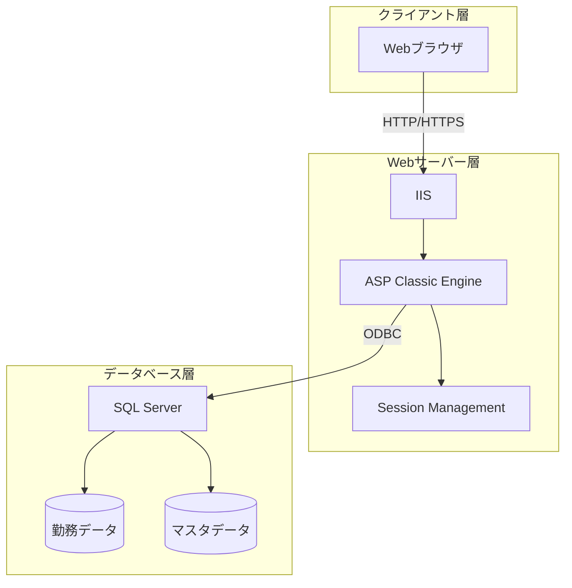
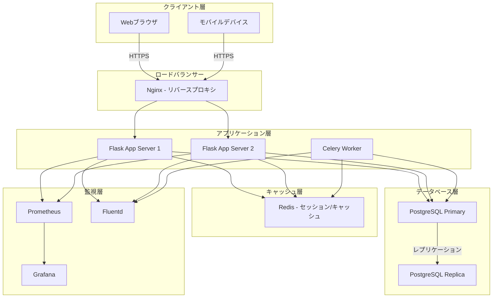

# システム概要書 - 勤務表管理システム

## 1. システムの目的と機能概要

### 1.1 システムの目的
本システムは、従業員の勤務時間管理、残業時間管理、休暇管理を一元的に行うWebベースの勤務表管理システムです。日本の労働基準法および36協定に準拠した労働時間管理を実現し、以下の目的を達成します：

- 従業員の正確な勤務時間記録と管理
- 労働基準法および36協定の遵守監視
- 上長による勤務承認プロセスの効率化
- 人事部門による一括管理機能の提供
- 各種労働時間の自動計算（残業、深夜労働、休日出勤等）

### 1.2 主要機能

1. **認証・権限管理**
   - ユーザー認証（ID/パスワード）
   - 役割ベースのアクセス制御（一般職員、上長、人事担当者、支店控除担当者）

2. **勤務時間管理**
   - 日次勤務時間入力
   - タイムカード連携
   - 勤務パターン対応（通常勤務、フレックスタイム、シフト勤務）
   - 自動計算機能（残業、深夜、休日出勤時間）

3. **承認ワークフロー**
   - 上長による勤務実績承認
   - 承認状況の可視化
   - エラーチェック機能

4. **休暇管理**
   - 有給休暇、代休、特別休暇の管理
   - 時間単位休暇対応
   - 残日数管理

5. **コンプライアンス機能**
   - 36協定違反チェック
   - 労働時間上限アラート
   - 月次・年次集計

6. **データ入出力**
   - CSV/Excelインポート・エクスポート
   - 月次勤務表出力
   - 各種帳票出力

## 2. 現行システムの構成と技術スタック

### 2.1 技術スタック

| コンポーネント | 技術 | 備考 |
|---------|------|------|
| プログラミング言語 | ASP Classic (VBScript) | サーバーサイドスクリプト |
| Webサーバー | IIS (Internet Information Services) | Windows Server上で動作 |
| データベース | Microsoft SQL Server | ODBC接続 |
| クライアント技術 | HTML, CSS, JavaScript | jQuery使用 |
| 文字エンコーディング | UTF-8 (CODEPAGE 65001) | |
| 認証方式 | SHA1ハッシュ + セッション | |

### 2.2 システム構成図



### 2.3 主要ファイル構成

```
/
├── index.asp              # ログインページ
├── inputwork.asp          # 勤務入力画面
├── checklist.asp          # 承認画面
├── inputall.asp           # 一括入力画面
├── workstatus.asp         # 勤務状況一覧
├── timecard.asp           # タイムカード表示
├── /inc/                  # 共通関数
│   ├── util.asp          # 時間計算ユーティリティ
│   ├── RestrictAccess.asp # アクセス制御
│   └── upsert_worktbl.asp # データ更新処理
├── /Connections/          # DB接続設定
├── /css/                  # スタイルシート
└── /js/                   # JavaScriptライブラリ
```

## 3. 移行後システムの構成と技術スタック

### 3.1 技術スタック

| コンポーネント | 現行技術 | 移行後技術 | 選定理由 |
|---------|---------|----------|---------|
| OS | Windows Server | Ubuntu Server 22.04 LTS | コスト削減、安定性向上 |
| Webサーバー | IIS | Nginx | 高性能、設定の柔軟性 |
| アプリケーションサーバー | ASP Classic | Python 3.11 + Flask 3.0 | モダンな開発環境、豊富なライブラリ |
| データベース | SQL Server | PostgreSQL 15 | オープンソース、高機能 |
| セッション管理 | IISセッション | Redis + Flask-Session | スケーラビリティ、高速化 |
| 認証方式 | SHA1 | bcrypt + JWT | セキュリティ強化 |
| フロントエンド | サーバーサイドHTML | Jinja2テンプレート + Bootstrap 5 | レスポンシブ対応、UX向上 |
| APIフレームワーク | - | Flask-RESTful | REST API対応 |
| ORM | ADO (直接SQL) | SQLAlchemy | 保守性向上、SQL注入対策 |
| マイグレーション | - | Alembic | データベース変更管理 |
| タスクキュー | - | Celery + Redis | 非同期処理対応 |
| ログ管理 | - | Python logging + Fluentd | 統合ログ管理 |
| 監視 | - | Prometheus + Grafana | システム監視 |

### 3.2 移行後システム構成図



### 3.3 ディレクトリ構成

```
/opt/attendance-system/
├── app/
│   ├── __init__.py          # Flask アプリケーション初期化
│   ├── config.py            # 設定管理
│   ├── models/              # SQLAlchemyモデル
│   │   ├── __init__.py
│   │   ├── staff.py         # 職員モデル
│   │   ├── work.py          # 勤務記録モデル
│   │   └── organization.py  # 組織モデル
│   ├── views/               # ビュー（コントローラー）
│   │   ├── __init__.py
│   │   ├── auth.py          # 認証関連
│   │   ├── work_entry.py    # 勤務入力
│   │   ├── approval.py      # 承認処理
│   │   └── admin.py         # 管理機能
│   ├── api/                 # REST API
│   │   ├── __init__.py
│   │   └── v1/
│   ├── services/            # ビジネスロジック層
│   │   ├── __init__.py
│   │   ├── overtime_calc.py # 残業計算
│   │   ├── compliance.py    # コンプライアンスチェック
│   │   └── holiday.py       # 休暇管理
│   ├── utils/               # ユーティリティ
│   │   ├── __init__.py
│   │   ├── time_utils.py    # 時間計算
│   │   └── validators.py    # バリデーション
│   ├── templates/           # Jinja2テンプレート
│   └── static/              # 静的ファイル
├── migrations/              # Alembicマイグレーション
├── tests/                   # テストコード
├── requirements.txt         # Python依存関係
├── docker-compose.yml       # Docker構成
├── nginx.conf              # Nginx設定
└── .env.example            # 環境変数サンプル
```

## 4. 移行の理由と効果

### 4.1 移行の理由

1. **技術的負債の解消**
   - ASP Classicのサポート終了リスク
   - 開発者確保の困難性
   - モダンな開発手法の導入困難

2. **セキュリティ強化**
   - SHA1からbcrypt/JWTへの移行
   - SQLインジェクション対策の強化
   - HTTPS強制とCSRF対策

3. **パフォーマンス向上**
   - Redisキャッシュによる高速化
   - 非同期処理による応答性向上
   - データベースクエリの最適化

4. **保守性向上**
   - モジュラー設計による責務分離
   - 自動テストの導入
   - ドキュメント自動生成

5. **コスト削減**
   - ライセンス費用の削減
   - インフラコストの最適化
   - 運用自動化による人的コスト削減

### 4.2 期待される効果

| 項目 | 現状 | 移行後 | 改善率 |
|------|-----|--------|-------|
| ページロード時間 | 3-5秒 | 0.5-1秒 | 80%削減 |
| 同時接続可能数 | 100ユーザー | 1000ユーザー | 10倍 |
| システム可用性 | 95% | 99.9% | 高可用性実現 |
| デプロイ時間 | 手動30分 | 自動5分 | 83%削減 |
| ライセンスコスト | 年間200万円 | 0円 | 100%削減 |
| セキュリティ脆弱性 | 中リスク | 低リスク | リスク軽減 |

### 4.3 移行アプローチ

1. **段階的移行戦略**
   - Phase 1: 認証システムとマスタ管理機能
   - Phase 2: 勤務入力・承認機能
   - Phase 3: レポート・集計機能
   - Phase 4: 完全移行と旧システム停止

2. **データ移行**
   - 既存データの完全移行
   - 文字コード変換（必要に応じて）
   - パスワードの再設定プロセス

3. **並行稼働期間**
   - 3ヶ月間の並行稼働
   - データ同期バッチの実装
   - 段階的なユーザー移行

## 5. リスクと対策

| リスク | 影響度 | 対策 |
|--------|-------|------|
| データ移行の失敗 | 高 | 事前検証環境での複数回テスト、ロールバック計画 |
| パフォーマンス劣化 | 中 | 負荷テストの実施、キャッシュ戦略の最適化 |
| ユーザー教育不足 | 中 | 段階的移行、操作マニュアル作成、研修実施 |
| 互換性問題 | 低 | 既存機能の完全な仕様化、回帰テスト |

## 6. 成功基準

1. **機能要件**
   - 既存システムの全機能が正常動作すること
   - レスポンスタイムが現行システムより改善すること
   - 99.9%以上の可用性を達成すること

2. **非機能要件**
   - 1000人同時アクセスに対応すること
   - 5年間のデータ保持が可能なこと
   - 災害時のRPO 1時間、RTO 4時間を達成すること

3. **運用要件**
   - 自動バックアップ・リストアが可能なこと
   - ログ監視・アラート通知が自動化されること
   - セキュリティパッチの自動適用が可能なこと