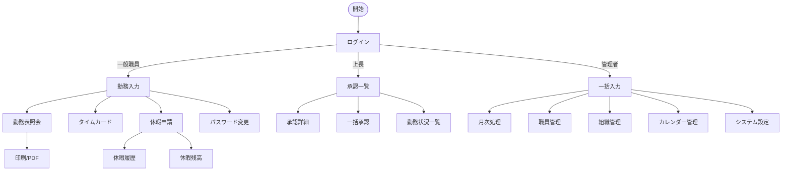

# 画面仕様書 - 勤務表管理システム

## 1. UI/UX基本方針

### 1.1 デザインコンセプト

- **レスポンシブデザイン**: PC、タブレット、スマートフォンに対応
- **アクセシビリティ**: WCAG 2.1 レベルAA準拠
- **ユーザビリティ**: 直感的な操作性と視認性の高いインターフェース
- **一貫性**: 統一されたデザインシステムによる操作体験
- **パフォーマンス**: 高速な画面遷移とレスポンス

### 1.2 技術スタック

| 要素 | 技術 | バージョン | 用途 |
|------|------|-----------|------|
| CSSフレームワーク | Bootstrap | 5.3 | レスポンシブグリッド、UIコンポーネント |
| JavaScriptフレームワーク | Alpine.js | 3.x | インタラクティブUI |
| アイコン | Bootstrap Icons | 1.11 | UIアイコン |
| グラフ | Chart.js | 4.x | データビジュアライゼーション |
| 日付選択 | Flatpickr | 4.6 | 日付・時刻入力 |
| テーブル | DataTables | 1.13 | 高機能テーブル |
| 通知 | Toastr | 2.1 | トースト通知 |
| バリデーション | Parsley.js | 2.9 | フォームバリデーション |

### 1.3 カラースキーム

```css
:root {
  /* プライマリカラー */
  --primary: #2c3e50;           /* 濃紺 - メインカラー */
  --primary-light: #34495e;     /* 明るい濃紺 */
  --primary-dark: #1a252f;      /* 暗い濃紺 */
  
  /* セカンダリカラー */
  --secondary: #3498db;         /* 青 - アクセントカラー */
  --secondary-light: #5dade2;   /* 明るい青 */
  --secondary-dark: #2874a6;    /* 暗い青 */
  
  /* ステータスカラー */
  --success: #27ae60;           /* 緑 - 成功・承認済み */
  --warning: #f39c12;           /* オレンジ - 警告・要確認 */
  --danger: #e74c3c;            /* 赤 - エラー・却下 */
  --info: #16a085;              /* 青緑 - 情報 */
  
  /* グレースケール */
  --gray-100: #f8f9fa;
  --gray-200: #e9ecef;
  --gray-300: #dee2e6;
  --gray-400: #ced4da;
  --gray-500: #adb5bd;
  --gray-600: #6c757d;
  --gray-700: #495057;
  --gray-800: #343a40;
  --gray-900: #212529;
  
  /* 背景色 */
  --bg-primary: #ffffff;
  --bg-secondary: #f8f9fa;
  --bg-tertiary: #e9ecef;
}
```

### 1.4 タイポグラフィ

```css
/* フォントファミリー */
--font-primary: 'Noto Sans JP', -apple-system, BlinkMacSystemFont, 'Segoe UI', sans-serif;
--font-mono: 'Noto Sans Mono', 'Courier New', monospace;

/* フォントサイズ */
--fs-xs: 0.75rem;    /* 12px */
--fs-sm: 0.875rem;   /* 14px */
--fs-base: 1rem;     /* 16px */
--fs-lg: 1.125rem;   /* 18px */
--fs-xl: 1.25rem;    /* 20px */
--fs-2xl: 1.5rem;    /* 24px */
--fs-3xl: 1.875rem;  /* 30px */

/* 行間 */
--lh-tight: 1.25;
--lh-normal: 1.5;
--lh-relaxed: 1.75;
```

## 2. 画面一覧

### 2.1 共通画面

| 画面ID | 画面名 | URL | 説明 |
|--------|--------|-----|------|
| CMN001 | ログイン | /login | ユーザー認証画面 |
| CMN002 | パスワード変更 | /password/change | パスワード変更画面 |
| CMN003 | エラー | /error | システムエラー表示 |
| CMN004 | メンテナンス | /maintenance | メンテナンス中表示 |

### 2.2 勤務管理画面

| 画面ID | 画面名 | URL | 説明 |
|--------|--------|-----|------|
| ATT001 | 勤務入力 | /attendance/entry | 個人勤務入力画面 |
| ATT002 | 勤務表照会 | /attendance/view | 勤務表表示・印刷 |
| ATT003 | タイムカード | /attendance/timecard | タイムカード打刻履歴 |
| ATT004 | 勤務状況一覧 | /attendance/status | 部門勤務状況表示 |

### 2.3 承認管理画面

| 画面ID | 画面名 | URL | 説明 |
|--------|--------|-----|------|
| APR001 | 承認一覧 | /approval/list | 承認待ち一覧表示 |
| APR002 | 承認詳細 | /approval/detail/{id} | 個別承認処理 |
| APR003 | 一括承認 | /approval/batch | 複数選択承認 |

### 2.4 休暇管理画面

| 画面ID | 画面名 | URL | 説明 |
|--------|--------|-----|------|
| LEV001 | 休暇申請 | /leave/apply | 休暇申請入力 |
| LEV002 | 休暇履歴 | /leave/history | 休暇取得履歴照会 |
| LEV003 | 休暇残高 | /leave/balance | 休暇残日数照会 |

### 2.5 管理者画面

| 画面ID | 画面名 | URL | 説明 |
|--------|--------|-----|------|
| ADM001 | 一括入力 | /admin/bulk-entry | 全社員勤務一括入力 |
| ADM002 | 月次処理 | /admin/monthly | 月次締め処理 |
| ADM003 | 職員管理 | /admin/staff | 職員マスタ管理 |
| ADM004 | 組織管理 | /admin/organization | 組織マスタ管理 |
| ADM005 | カレンダー管理 | /admin/calendar | 休日カレンダー管理 |
| ADM006 | システム設定 | /admin/settings | システム設定管理 |

## 3. 画面遷移図



## 4. 共通レイアウト

### 4.1 デスクトップレイアウト

```html
<!DOCTYPE html>
<html lang="ja">
<head>
    <meta charset="UTF-8">
    <meta name="viewport" content="width=device-width, initial-scale=1.0">
    <title>勤務表管理システム</title>
    <link href="/static/css/bootstrap.min.css" rel="stylesheet">
    <link href="/static/css/app.css" rel="stylesheet">
</head>
<body>
    <!-- ヘッダー -->
    <header class="navbar navbar-expand-lg navbar-dark bg-primary fixed-top">
        <div class="container-fluid">
            <a class="navbar-brand" href="/">
                <i class="bi bi-calendar3"></i> 勤務表管理システム
            </a>
            
            <!-- ナビゲーションメニュー -->
            <button class="navbar-toggler" type="button" data-bs-toggle="collapse" data-bs-target="#navbarNav">
                <span class="navbar-toggler-icon"></span>
            </button>
            
            <div class="collapse navbar-collapse" id="navbarNav">
                <ul class="navbar-nav me-auto">
                    <li class="nav-item">
                        <a class="nav-link" href="/attendance/entry">勤務入力</a>
                    </li>
                    <li class="nav-item">
                        <a class="nav-link" href="/attendance/view">勤務表照会</a>
                    </li>
                    <li class="nav-item">
                        <a class="nav-link" href="/leave/apply">休暇申請</a>
                    </li>
                </ul>
                
                <!-- ユーザー情報 -->
                <div class="navbar-text text-white me-3">
                    <i class="bi bi-person-circle"></i> 
                    <span id="userName">山田太郎</span>
                    <small class="text-light">（営業部）</small>
                </div>
                
                <!-- ログアウト -->
                <button class="btn btn-outline-light btn-sm" onclick="logout()">
                    <i class="bi bi-box-arrow-right"></i> ログアウト
                </button>
            </div>
        </div>
    </header>
    
    <!-- メインコンテンツ -->
    <main class="container-fluid mt-5 pt-4">
        <div class="row">
            <!-- サイドバー（管理者のみ） -->
            <aside class="col-md-2 d-none d-md-block bg-light py-3" id="sidebar">
                <h6 class="text-muted px-3">管理メニュー</h6>
                <nav class="nav flex-column">
                    <a class="nav-link" href="/admin/bulk-entry">
                        <i class="bi bi-pencil-square"></i> 一括入力
                    </a>
                    <a class="nav-link" href="/admin/monthly">
                        <i class="bi bi-calendar-check"></i> 月次処理
                    </a>
                    <a class="nav-link" href="/admin/staff">
                        <i class="bi bi-people"></i> 職員管理
                    </a>
                </nav>
            </aside>
            
            <!-- コンテンツエリア -->
            <div class="col-md-10" id="content">
                <!-- パンくずリスト -->
                <nav aria-label="breadcrumb">
                    <ol class="breadcrumb">
                        <li class="breadcrumb-item"><a href="/">ホーム</a></li>
                        <li class="breadcrumb-item active">勤務入力</li>
                    </ol>
                </nav>
                
                <!-- ページタイトル -->
                <h1 class="h3 mb-4">勤務入力</h1>
                
                <!-- アラート表示エリア -->
                <div id="alertArea"></div>
                
                <!-- ページ固有コンテンツ -->
                
            </div>
        </div>
    </main>
    
    <!-- フッター -->
    <footer class="footer mt-5 py-3 bg-light">
        <div class="container text-center text-muted">
            <small>&copy; 2024 勤務表管理システム</small>
        </div>
    </footer>
    
    <!-- 共通JavaScript -->
    <script src="/static/js/bootstrap.bundle.min.js"></script>
    <script src="/static/js/app.js"></script>
</body>
</html>
```

### 4.2 モバイルレイアウト対応

```css
/* レスポンシブ対応 */
@media (max-width: 768px) {
    /* サイドバーをオフキャンバスに変更 */
    #sidebar {
        position: fixed;
        top: 56px;
        left: -250px;
        width: 250px;
        height: 100vh;
        background: white;
        transition: left 0.3s;
        z-index: 1040;
    }
    
    #sidebar.show {
        left: 0;
    }
    
    /* コンテンツ幅調整 */
    #content {
        width: 100%;
    }
    
    /* テーブルのレスポンシブ対応 */
    .table-responsive-stack tr {
        display: block;
        border: 1px solid #ccc;
        margin-bottom: 10px;
    }
    
    .table-responsive-stack td {
        display: block;
        text-align: right;
        padding-left: 50%;
        position: relative;
    }
    
    .table-responsive-stack td:before {
        content: attr(data-label);
        position: absolute;
        left: 6px;
        width: 45%;
        text-align: left;
        font-weight: bold;
    }
}
```

## 5. 主要画面詳細

### 5.1 ログイン画面 (CMN001)

#### 画面レイアウト

```html
<div class="container">
    <div class="row justify-content-center min-vh-100 align-items-center">
        <div class="col-md-5 col-lg-4">
            <div class="card shadow">
                <div class="card-body p-5">
                    <div class="text-center mb-4">
                        <i class="bi bi-calendar3 text-primary" style="font-size: 3rem;"></i>
                        <h2 class="h4 mt-2">勤務表管理システム</h2>
                    </div>
                    
                    <form id="loginForm" novalidate>
                        <!-- ユーザーID -->
                        <div class="mb-3">
                            <label for="userId" class="form-label">ユーザーID</label>
                            <input type="text" 
                                   class="form-control" 
                                   id="userId" 
                                   name="userId"
                                   pattern="\d{5}"
                                   maxlength="5"
                                   required
                                   autofocus>
                            <div class="invalid-feedback">
                                5桁の数字で入力してください
                            </div>
                        </div>
                        
                        <!-- パスワード -->
                        <div class="mb-3">
                            <label for="password" class="form-label">パスワード</label>
                            <div class="input-group">
                                <input type="password" 
                                       class="form-control" 
                                       id="password" 
                                       name="password"
                                       required>
                                <button class="btn btn-outline-secondary" 
                                        type="button" 
                                        id="togglePassword">
                                    <i class="bi bi-eye"></i>
                                </button>
                            </div>
                            <div class="invalid-feedback">
                                パスワードを入力してください
                            </div>
                        </div>
                        
                        <!-- ログイン状態を保持 -->
                        <div class="mb-4">
                            <div class="form-check">
                                <input class="form-check-input" 
                                       type="checkbox" 
                                       id="rememberMe">
                                <label class="form-check-label" for="rememberMe">
                                    ログイン状態を保持する
                                </label>
                            </div>
                        </div>
                        
                        <!-- ログインボタン -->
                        <button type="submit" 
                                class="btn btn-primary w-100 py-2">
                            <i class="bi bi-box-arrow-in-right"></i> ログイン
                        </button>
                    </form>
                    
                    <div class="text-center mt-3">
                        <a href="/password/reset" class="text-muted small">
                            パスワードを忘れた方はこちら
                        </a>
                    </div>
                </div>
            </div>
            
            <!-- システムメッセージ -->
            <div class="alert alert-info mt-3" role="alert">
                <i class="bi bi-info-circle"></i>
                <small>推奨環境: Chrome, Edge, Safari の最新版</small>
            </div>
        </div>
    </div>
</div>
```

#### バリデーション仕様

```javascript
// ログインフォームバリデーション
document.getElementById('loginForm').addEventListener('submit', async (e) => {
    e.preventDefault();
    
    const form = e.target;
    
    // Bootstrap標準バリデーション
    if (!form.checkValidity()) {
        e.stopPropagation();
        form.classList.add('was-validated');
        return;
    }
    
    // カスタムバリデーション
    const userId = form.userId.value;
    const password = form.password.value;
    
    // ユーザーID形式チェック
    if (!/^\d{5}$/.test(userId)) {
        showError('ユーザーIDは5桁の数字で入力してください');
        return;
    }
    
    // パスワード長チェック
    if (password.length < 8) {
        showError('パスワードは8文字以上で入力してください');
        return;
    }
    
    // ログイン処理
    try {
        const response = await login(userId, password);
        if (response.success) {
            window.location.href = response.redirectUrl;
        }
    } catch (error) {
        showError('ログインに失敗しました');
    }
});
```

### 5.2 勤務入力画面 (ATT001)

#### 画面レイアウト

```html
<div class="container-fluid">
    <!-- ヘッダー部 -->
    <div class="row mb-4">
        <div class="col-12">
            <div class="card">
                <div class="card-body">
                    <div class="row align-items-center">
                        <!-- 年月選択 -->
                        <div class="col-md-4">
                            <div class="input-group">
                                <button class="btn btn-outline-secondary" id="prevMonth">
                                    <i class="bi bi-chevron-left"></i>
                                </button>
                                <input type="month" 
                                       class="form-control text-center" 
                                       id="targetMonth" 
                                       value="2024-01">
                                <button class="btn btn-outline-secondary" id="nextMonth">
                                    <i class="bi bi-chevron-right"></i>
                                </button>
                            </div>
                        </div>
                        
                        <!-- アクションボタン -->
                        <div class="col-md-8 text-end">
                            <button class="btn btn-outline-primary" id="importTimecard">
                                <i class="bi bi-clock-history"></i> タイムカード取込
                            </button>
                            <button class="btn btn-outline-secondary" id="saveDraft">
                                <i class="bi bi-save"></i> 一時保存
                            </button>
                            <button class="btn btn-primary" id="submitApproval">
                                <i class="bi bi-check-circle"></i> 承認申請
                            </button>
                        </div>
                    </div>
                </div>
            </div>
        </div>
    </div>
    
    <!-- 勤務入力テーブル -->
    <div class="row">
        <div class="col-12">
            <div class="card">
                <div class="card-body p-0">
                    <div class="table-responsive">
                        <table class="table table-bordered table-hover mb-0" id="attendanceTable">
                            <thead class="table-light sticky-top">
                                <tr>
                                    <th rowspan="2" class="text-center" style="width: 50px;">日</th>
                                    <th rowspan="2" class="text-center" style="width: 50px;">曜</th>
                                    <th colspan="2" class="text-center">勤務時間</th>
                                    <th colspan="2" class="text-center">休憩</th>
                                    <th rowspan="2" class="text-center" style="width: 80px;">実働</th>
                                    <th rowspan="2" class="text-center" style="width: 80px;">残業</th>
                                    <th rowspan="2" class="text-center" style="width: 80px;">深夜</th>
                                    <th rowspan="2" class="text-center" style="width: 100px;">勤務区分</th>
                                    <th rowspan="2" class="text-center" style="width: 150px;">備考</th>
                                    <th rowspan="2" class="text-center" style="width: 50px;">
                                        <i class="bi bi-gear"></i>
                                    </th>
                                </tr>
                                <tr>
                                    <th class="text-center">開始</th>
                                    <th class="text-center">終了</th>
                                    <th class="text-center">開始</th>
                                    <th class="text-center">終了</th>
                                </tr>
                            </thead>
                            <tbody>
                                <!-- 動的生成される行 -->
                                <tr data-date="2024-01-01" class="holiday-row">
                                    <td class="text-center">1</td>
                                    <td class="text-center text-danger">月</td>
                                    <td colspan="10" class="text-center text-muted">
                                        <i class="bi bi-calendar-x"></i> 元日
                                    </td>
                                </tr>
                                
                                <tr data-date="2024-01-04" class="weekday-row">
                                    <td class="text-center">4</td>
                                    <td class="text-center">木</td>
                                    <td>
                                        <input type="time" 
                                               class="form-control form-control-sm time-input" 
                                               name="work_start"
                                               value="08:30">
                                    </td>
                                    <td>
                                        <input type="time" 
                                               class="form-control form-control-sm time-input" 
                                               name="work_end"
                                               value="17:30">
                                    </td>
                                    <td>
                                        <input type="time" 
                                               class="form-control form-control-sm time-input" 
                                               name="break_start"
                                               value="12:00">
                                    </td>
                                    <td>
                                        <input type="time" 
                                               class="form-control form-control-sm time-input" 
                                               name="break_end"
                                               value="13:00">
                                    </td>
                                    <td class="text-center calculated" data-field="actual_work">8:00</td>
                                    <td class="text-center calculated" data-field="overtime">0:00</td>
                                    <td class="text-center calculated" data-field="late_night">0:00</td>
                                    <td>
                                        <select class="form-select form-select-sm" name="work_type">
                                            <option value="1">通常勤務</option>
                                            <option value="2">時差出勤</option>
                                            <option value="3">在宅勤務</option>
                                        </select>
                                    </td>
                                    <td>
                                        <input type="text" 
                                               class="form-control form-control-sm" 
                                               name="memo"
                                               maxlength="50">
                                    </td>
                                    <td class="text-center">
                                        <button class="btn btn-sm btn-outline-secondary" 
                                                title="詳細設定">
                                            <i class="bi bi-three-dots"></i>
                                        </button>
                                    </td>
                                </tr>
                            </tbody>
                            <tfoot class="table-secondary">
                                <tr>
                                    <th colspan="6" class="text-end">月間集計</th>
                                    <th class="text-center" id="totalActual">160:00</th>
                                    <th class="text-center" id="totalOvertime">20:30</th>
                                    <th class="text-center" id="totalLateNight">2:00</th>
                                    <th colspan="3"></th>
                                </tr>
                            </tfoot>
                        </table>
                    </div>
                </div>
            </div>
        </div>
    </div>
    
    <!-- 36協定チェック -->
    <div class="row mt-3">
        <div class="col-12">
            <div class="card">
                <div class="card-header">
                    <h6 class="mb-0">
                        <i class="bi bi-shield-check"></i> 36協定チェック
                    </h6>
                </div>
                <div class="card-body">
                    <div class="row">
                        <div class="col-md-3">
                            <div class="progress-item">
                                <div class="d-flex justify-content-between mb-1">
                                    <span>月間残業時間</span>
                                    <span class="fw-bold">20.5 / 45時間</span>
                                </div>
                                <div class="progress" style="height: 20px;">
                                    <div class="progress-bar bg-success" 
                                         role="progressbar" 
                                         style="width: 45%">
                                    </div>
                                </div>
                            </div>
                        </div>
                        
                        <div class="col-md-3">
                            <div class="progress-item">
                                <div class="d-flex justify-content-between mb-1">
                                    <span>年間残業時間</span>
                                    <span class="fw-bold">180 / 360時間</span>
                                </div>
                                <div class="progress" style="height: 20px;">
                                    <div class="progress-bar bg-warning" 
                                         role="progressbar" 
                                         style="width: 50%">
                                    </div>
                                </div>
                            </div>
                        </div>
                        
                        <div class="col-md-3">
                            <div class="progress-item">
                                <div class="d-flex justify-content-between mb-1">
                                    <span>2-6ヶ月平均</span>
                                    <span class="fw-bold">65 / 80時間</span>
                                </div>
                                <div class="progress" style="height: 20px;">
                                    <div class="progress-bar bg-danger" 
                                         role="progressbar" 
                                         style="width: 81%">
                                    </div>
                                </div>
                            </div>
                        </div>
                        
                        <div class="col-md-3">
                            <div class="alert alert-warning mb-0" role="alert">
                                <i class="bi bi-exclamation-triangle"></i>
                                <small>2-6ヶ月平均が上限に近づいています</small>
                            </div>
                        </div>
                    </div>
                </div>
            </div>
        </div>
    </div>
</div>

<!-- 詳細設定モーダル -->
<div class="modal fade" id="detailModal" tabindex="-1">
    <div class="modal-dialog">
        <div class="modal-content">
            <div class="modal-header">
                <h5 class="modal-title">詳細設定</h5>
                <button type="button" class="btn-close" data-bs-dismiss="modal"></button>
            </div>
            <div class="modal-body">
                <!-- 休暇設定 -->
                <div class="mb-3">
                    <label class="form-label">休暇区分</label>
                    <div class="row">
                        <div class="col-6">
                            <select class="form-select" id="morningLeave">
                                <option value="">午前：出勤</option>
                                <option value="1">午前：有給</option>
                                <option value="2">午前：代休</option>
                                <option value="3">午前：特別休暇</option>
                            </select>
                        </div>
                        <div class="col-6">
                            <select class="form-select" id="afternoonLeave">
                                <option value="">午後：出勤</option>
                                <option value="1">午後：有給</option>
                                <option value="2">午後：代休</option>
                                <option value="3">午後：特別休暇</option>
                            </select>
                        </div>
                    </div>
                </div>
                
                <!-- 時間休設定 -->
                <div class="mb-3">
                    <label class="form-label">時間休</label>
                    <div class="row">
                        <div class="col-6">
                            <input type="time" class="form-control" id="timeOffStart">
                        </div>
                        <div class="col-6">
                            <input type="time" class="form-control" id="timeOffEnd">
                        </div>
                    </div>
                </div>
                
                <!-- その他設定 -->
                <div class="mb-3">
                    <div class="form-check">
                        <input class="form-check-input" type="checkbox" id="nightDuty">
                        <label class="form-check-label" for="nightDuty">
                            宿直勤務
                        </label>
                    </div>
                    <div class="form-check">
                        <input class="form-check-input" type="checkbox" id="dayDuty">
                        <label class="form-check-label" for="dayDuty">
                            日直勤務
                        </label>
                    </div>
                </div>
            </div>
            <div class="modal-footer">
                <button type="button" class="btn btn-secondary" data-bs-dismiss="modal">
                    キャンセル
                </button>
                <button type="button" class="btn btn-primary" id="saveDetail">
                    保存
                </button>
            </div>
        </div>
    </div>
</div>
```

#### インタラクション仕様

```javascript
// 時間入力時の自動計算
document.querySelectorAll('.time-input').forEach(input => {
    input.addEventListener('change', calculateWorkHours);
});

function calculateWorkHours() {
    const row = this.closest('tr');
    const workStart = row.querySelector('[name="work_start"]').value;
    const workEnd = row.querySelector('[name="work_end"]').value;
    const breakStart = row.querySelector('[name="break_start"]').value;
    const breakEnd = row.querySelector('[name="break_end"]').value;
    
    if (workStart && workEnd) {
        // 実働時間計算
        const actualMinutes = calculateMinutes(workStart, workEnd) - 
                            calculateMinutes(breakStart, breakEnd);
        
        // 残業時間計算（8時間超過分）
        const overtimeMinutes = Math.max(0, actualMinutes - 480);
        
        // 深夜時間計算（22:00-05:00）
        const lateNightMinutes = calculateLateNight(workStart, workEnd);
        
        // 表示更新
        row.querySelector('[data-field="actual_work"]').textContent = 
            formatMinutes(actualMinutes);
        row.querySelector('[data-field="overtime"]').textContent = 
            formatMinutes(overtimeMinutes);
        row.querySelector('[data-field="late_night"]').textContent = 
            formatMinutes(lateNightMinutes);
        
        // エラーチェック
        checkCompliance(row, overtimeMinutes);
    }
}

// 36協定チェック
function checkCompliance(row, overtimeMinutes) {
    const date = row.dataset.date;
    
    // 日次上限チェック（14時間）
    if (overtimeMinutes > 840) {
        row.classList.add('table-danger');
        showToast('警告', '1日の残業時間が14時間を超えています', 'warning');
    }
    
    // 月次・年次チェック
    updateComplianceStatus();
}
```

### 5.3 承認一覧画面 (APR001)

#### 画面レイアウト

```html
<div class="container-fluid">
    <!-- フィルター -->
    <div class="row mb-3">
        <div class="col-12">
            <div class="card">
                <div class="card-body">
                    <form class="row g-3">
                        <div class="col-md-3">
                            <label class="form-label">対象年月</label>
                            <input type="month" class="form-control" value="2024-01">
                        </div>
                        <div class="col-md-3">
                            <label class="form-label">部署</label>
                            <select class="form-select">
                                <option value="">全部署</option>
                                <option value="110000">東日本営業部</option>
                                <option value="111000">東京支店</option>
                            </select>
                        </div>
                        <div class="col-md-3">
                            <label class="form-label">承認状態</label>
                            <select class="form-select">
                                <option value="">すべて</option>
                                <option value="pending">承認待ち</option>
                                <option value="approved">承認済み</option>
                                <option value="rejected">差戻し</option>
                            </select>
                        </div>
                        <div class="col-md-3 d-flex align-items-end">
                            <button type="submit" class="btn btn-primary">
                                <i class="bi bi-search"></i> 検索
                            </button>
                        </div>
                    </form>
                </div>
            </div>
        </div>
    </div>
    
    <!-- 承認一覧 -->
    <div class="row">
        <div class="col-12">
            <div class="card">
                <div class="card-header">
                    <div class="d-flex justify-content-between align-items-center">
                        <h5 class="mb-0">承認対象一覧</h5>
                        <button class="btn btn-success" id="batchApprove">
                            <i class="bi bi-check-all"></i> 一括承認
                        </button>
                    </div>
                </div>
                <div class="card-body p-0">
                    <div class="table-responsive">
                        <table class="table table-hover mb-0">
                            <thead class="table-light">
                                <tr>
                                    <th style="width: 40px;">
                                        <input class="form-check-input" type="checkbox" id="selectAll">
                                    </th>
                                    <th>社員番号</th>
                                    <th>氏名</th>
                                    <th>部署</th>
                                    <th>勤務日数</th>
                                    <th>総労働時間</th>
                                    <th>残業時間</th>
                                    <th>ステータス</th>
                                    <th>申請日</th>
                                    <th style="width: 100px;">操作</th>
                                </tr>
                            </thead>
                            <tbody>
                                <tr>
                                    <td>
                                        <input class="form-check-input select-item" 
                                               type="checkbox" 
                                               value="10001">
                                    </td>
                                    <td>10001</td>
                                    <td>
                                        <a href="/approval/detail/10001">山田太郎</a>
                                    </td>
                                    <td>営業1課</td>
                                    <td class="text-center">20日</td>
                                    <td class="text-center">160:00</td>
                                    <td class="text-center">25:30</td>
                                    <td>
                                        <span class="badge bg-warning">承認待ち</span>
                                    </td>
                                    <td>2024/01/31</td>
                                    <td>
                                        <button class="btn btn-sm btn-success" 
                                                title="承認">
                                            <i class="bi bi-check-circle"></i>
                                        </button>
                                        <button class="btn btn-sm btn-danger" 
                                                title="差戻し">
                                            <i class="bi bi-x-circle"></i>
                                        </button>
                                    </td>
                                </tr>
                                
                                <tr class="table-danger">
                                    <td>
                                        <input class="form-check-input select-item" 
                                               type="checkbox" 
                                               value="10002"
                                               disabled>
                                    </td>
                                    <td>10002</td>
                                    <td>
                                        <a href="/approval/detail/10002">鈴木花子</a>
                                    </td>
                                    <td>営業2課</td>
                                    <td class="text-center">22日</td>
                                    <td class="text-center">200:00</td>
                                    <td class="text-center">
                                        <span class="text-danger fw-bold">52:00</span>
                                    </td>
                                    <td>
                                        <span class="badge bg-danger">要確認</span>
                                    </td>
                                    <td>2024/01/31</td>
                                    <td>
                                        <button class="btn btn-sm btn-warning" 
                                                title="詳細確認">
                                            <i class="bi bi-exclamation-triangle"></i>
                                        </button>
                                    </td>
                                </tr>
                            </tbody>
                        </table>
                    </div>
                </div>
                
                <!-- ページネーション -->
                <div class="card-footer">
                    <nav>
                        <ul class="pagination mb-0 justify-content-center">
                            <li class="page-item disabled">
                                <a class="page-link" href="#">前へ</a>
                            </li>
                            <li class="page-item active">
                                <a class="page-link" href="#">1</a>
                            </li>
                            <li class="page-item">
                                <a class="page-link" href="#">2</a>
                            </li>
                            <li class="page-item">
                                <a class="page-link" href="#">3</a>
                            </li>
                            <li class="page-item">
                                <a class="page-link" href="#">次へ</a>
                            </li>
                        </ul>
                    </nav>
                </div>
            </div>
        </div>
    </div>
</div>

<!-- 差戻しモーダル -->
<div class="modal fade" id="rejectModal" tabindex="-1">
    <div class="modal-dialog">
        <div class="modal-content">
            <div class="modal-header">
                <h5 class="modal-title">差戻し理由</h5>
                <button type="button" class="btn-close" data-bs-dismiss="modal"></button>
            </div>
            <div class="modal-body">
                <div class="mb-3">
                    <label class="form-label">差戻し理由を入力してください</label>
                    <textarea class="form-control" rows="4" required></textarea>
                </div>
                <div class="form-text">
                    入力内容は申請者に通知されます
                </div>
            </div>
            <div class="modal-footer">
                <button type="button" class="btn btn-secondary" data-bs-dismiss="modal">
                    キャンセル
                </button>
                <button type="button" class="btn btn-danger">
                    差戻し実行
                </button>
            </div>
        </div>
    </div>
</div>
```

## 6. レスポンシブデザイン仕様

### 6.1 ブレークポイント

| デバイス | ブレークポイント | グリッドカラム | 主な変更点 |
|---------|----------------|--------------|-----------|
| スマートフォン | < 576px | 1カラム | 縦スクロール、ハンバーガーメニュー |
| タブレット（縦） | 576px - 767px | 1-2カラム | サイドバー非表示 |
| タブレット（横） | 768px - 991px | 2カラム | 一部機能の簡略化 |
| デスクトップ | 992px - 1199px | 3カラム | フル機能 |
| 大画面 | ≥ 1200px | 3-4カラム | 余白調整 |

### 6.2 タッチデバイス対応

```css
/* タッチターゲットサイズ */
.btn, .form-control, .form-select {
    min-height: 44px;  /* iOS推奨サイズ */
}

/* タッチデバイスでのホバー無効化 */
@media (hover: none) {
    .btn:hover {
        background-color: inherit;
    }
}

/* スワイプ対応 */
.table-responsive {
    -webkit-overflow-scrolling: touch;
    overflow-x: auto;
}
```

## 7. アクセシビリティ仕様

### 7.1 WAI-ARIA属性

```html
<!-- ランドマーク -->
<nav role="navigation" aria-label="メインナビゲーション">
<main role="main" aria-label="メインコンテンツ">
<aside role="complementary" aria-label="サイドバー">

<!-- フォーム -->
<form role="form" aria-label="勤務入力フォーム">
    <div class="form-group">
        <label for="workStart" id="workStartLabel">出社時刻</label>
        <input type="time" 
               id="workStart" 
               aria-labelledby="workStartLabel"
               aria-required="true"
               aria-invalid="false">
        <div class="invalid-feedback" role="alert" aria-live="polite">
            時刻を入力してください
        </div>
    </div>
</form>

<!-- 動的コンテンツ -->
<div aria-live="polite" aria-atomic="true">
    <div id="notification" role="alert"></div>
</div>

<!-- テーブル -->
<table role="table" aria-label="勤務実績一覧">
    <caption class="visually-hidden">2024年1月の勤務実績</caption>
```

### 7.2 キーボードナビゲーション

```javascript
// フォーカス管理
const focusableElements = 'button, [href], input, select, textarea, [tabindex]:not([tabindex="-1"])';

// モーダル内フォーカストラップ
function trapFocus(element) {
    const focusableContent = element.querySelectorAll(focusableElements);
    const firstFocusable = focusableContent[0];
    const lastFocusable = focusableContent[focusableContent.length - 1];
    
    element.addEventListener('keydown', function(e) {
        if (e.key === 'Tab') {
            if (e.shiftKey) { // Shift + Tab
                if (document.activeElement === firstFocusable) {
                    lastFocusable.focus();
                    e.preventDefault();
                }
            } else { // Tab
                if (document.activeElement === lastFocusable) {
                    firstFocusable.focus();
                    e.preventDefault();
                }
            }
        }
        
        if (e.key === 'Escape') {
            closeModal();
        }
    });
}

// ショートカットキー
document.addEventListener('keydown', function(e) {
    // Ctrl + S: 保存
    if (e.ctrlKey && e.key === 's') {
        e.preventDefault();
        saveDraft();
    }
    
    // Alt + N: 次月へ
    if (e.altKey && e.key === 'n') {
        e.preventDefault();
        nextMonth();
    }
});
```

## 8. パフォーマンス最適化

### 8.1 画像最適化

```html
<!-- レスポンシブ画像 -->
<picture>
    <source media="(max-width: 576px)" srcset="/static/img/logo-sm.webp">
    <source media="(max-width: 992px)" srcset="/static/img/logo-md.webp">
    
</picture>

<!-- アイコンフォント -->
<link rel="preload" href="/static/fonts/bootstrap-icons.woff2" as="font" crossorigin>
```

### 8.2 JavaScript最適化

```javascript
// 遅延読み込み
const lazyLoadModules = {
    chart: () => import('./modules/chart.js'),
    export: () => import('./modules/export.js'),
    print: () => import('./modules/print.js')
};

// 仮想スクロール（大量データ表示）
class VirtualScroll {
    constructor(container, itemHeight, totalItems) {
        this.container = container;
        this.itemHeight = itemHeight;
        this.totalItems = totalItems;
        this.visibleItems = Math.ceil(container.clientHeight / itemHeight);
        this.render();
    }
    
    render() {
        const scrollTop = this.container.scrollTop;
        const startIndex = Math.floor(scrollTop / this.itemHeight);
        const endIndex = startIndex + this.visibleItems + 1;
        
        // 表示範囲のアイテムのみレンダリング
        this.renderItems(startIndex, endIndex);
    }
}
```

### 8.3 CSS最適化

```css
/* Critical CSS（インライン化） */
.container { width: 100%; max-width: 1200px; margin: 0 auto; }
.btn { display: inline-block; padding: 0.375rem 0.75rem; }

/* 非同期読み込み */
<link rel="preload" href="/static/css/app.css" as="style" onload="this.onload=null;this.rel='stylesheet'">

/* CSS コンテインメント */
.card {
    contain: layout style paint;
}

/* GPU アクセラレーション */
.modal {
    transform: translateZ(0);
    will-change: transform, opacity;
}
```

## 9. エラーハンドリングとフィードバック

### 9.1 エラー表示パターン

```javascript
// トースト通知
function showToast(title, message, type = 'info') {
    const toast = new bootstrap.Toast(createToastElement(title, message, type));
    toast.show();
}

// インラインエラー
function showFieldError(field, message) {
    field.classList.add('is-invalid');
    field.nextElementSibling.textContent = message;
    field.setAttribute('aria-invalid', 'true');
}

// モーダルエラー
function showErrorModal(error) {
    const modal = new bootstrap.Modal(document.getElementById('errorModal'));
    document.getElementById('errorMessage').textContent = error.message;
    modal.show();
}

// ページレベルエラー
function showPageError(error) {
    const alertHtml = `
        <div class="alert alert-danger alert-dismissible fade show" role="alert">
            <i class="bi bi-exclamation-triangle-fill"></i>
            <strong>エラー:</strong> ${error.message}
            <button type="button" class="btn-close" data-bs-dismiss="alert"></button>
        </div>
    `;
    document.getElementById('alertArea').innerHTML = alertHtml;
}
```

### 9.2 ローディング表示

```html
<!-- ボタンローディング -->
<button class="btn btn-primary" type="button" disabled>
    <span class="spinner-border spinner-border-sm" role="status"></span>
    処理中...
</button>

<!-- ページローディング -->
<div class="d-flex justify-content-center p-5">
    <div class="spinner-border text-primary" role="status">
        <span class="visually-hidden">Loading...</span>
    </div>
</div>

<!-- スケルトンスクリーン -->
<div class="card">
    <div class="card-body">
        <div class="placeholder-glow">
            <span class="placeholder col-6"></span>
            <span class="placeholder col-4"></span>
            <span class="placeholder col-8"></span>
        </div>
    </div>
</div>
```

## 10. プリント・PDF出力仕様

### 10.1 印刷用CSS

```css
@media print {
    /* 不要要素の非表示 */
    .navbar, .sidebar, .btn, .form-control {
        display: none !important;
    }
    
    /* 改ページ制御 */
    .page-break {
        page-break-after: always;
    }
    
    table {
        page-break-inside: avoid;
    }
    
    /* 背景色・罫線の強制表示 */
    * {
        -webkit-print-color-adjust: exact !important;
        print-color-adjust: exact !important;
    }
    
    /* A4サイズ最適化 */
    @page {
        size: A4;
        margin: 15mm;
    }
    
    body {
        font-size: 10pt;
        line-height: 1.5;
    }
}
```

### 10.2 PDF生成仕様

```javascript
// PDFエクスポート機能
async function exportPDF() {
    const { jsPDF } = await import('jspdf');
    const { default: autoTable } = await import('jspdf-autotable');
    
    const doc = new jsPDF({
        orientation: 'landscape',
        unit: 'mm',
        format: 'a4'
    });
    
    // 日本語フォント設定
    doc.addFont('/static/fonts/NotoSansJP-Regular.ttf', 'NotoSansJP', 'normal');
    doc.setFont('NotoSansJP');
    
    // タイトル
    doc.setFontSize(16);
    doc.text('勤務表', 15, 15);
    
    // テーブルデータ
    const tableData = getAttendanceData();
    
    autoTable(doc, {
        head: [['日付', '出社', '退社', '実働', '残業']],
        body: tableData,
        startY: 25,
        styles: {
            font: 'NotoSansJP',
            fontSize: 9
        }
    });
    
    // ダウンロード
    doc.save(`勤務表_${getCurrentMonth()}.pdf`);
}
```

## 11. セキュリティ対応UI

### 11.1 CSRF対策

```html
<!-- フォームにCSRFトークン埋め込み -->
<form method="POST" action="/attendance/save">
    <input type="hidden" name="csrf_token" value="{{ csrf_token }}">
    <!-- フォーム内容 -->
</form>
```

### 11.2 XSS対策

```javascript
// ユーザー入力のサニタイズ
function escapeHtml(text) {
    const map = {
        '&': '&amp;',
        '<': '&lt;',
        '>': '&gt;',
        '"': '&quot;',
        "'": '&#039;'
    };
    return text.replace(/[&<>"']/g, m => map[m]);
}

// 安全なDOM操作
element.textContent = userInput; // 自動的にエスケープ
// element.innerHTML = userInput; // 危険：使用しない
```

### 11.3 セッションタイムアウト警告

```javascript
// セッションタイムアウト警告
let warningTimer;
let logoutTimer;

function resetTimers() {
    clearTimeout(warningTimer);
    clearTimeout(logoutTimer);
    
    // 25分後に警告
    warningTimer = setTimeout(showTimeoutWarning, 25 * 60 * 1000);
    
    // 30分後に自動ログアウト
    logoutTimer = setTimeout(autoLogout, 30 * 60 * 1000);
}

function showTimeoutWarning() {
    const modal = new bootstrap.Modal(document.getElementById('timeoutModal'));
    modal.show();
}

// ユーザー操作でタイマーリセット
document.addEventListener('click', resetTimers);
document.addEventListener('keypress', resetTimers);
```